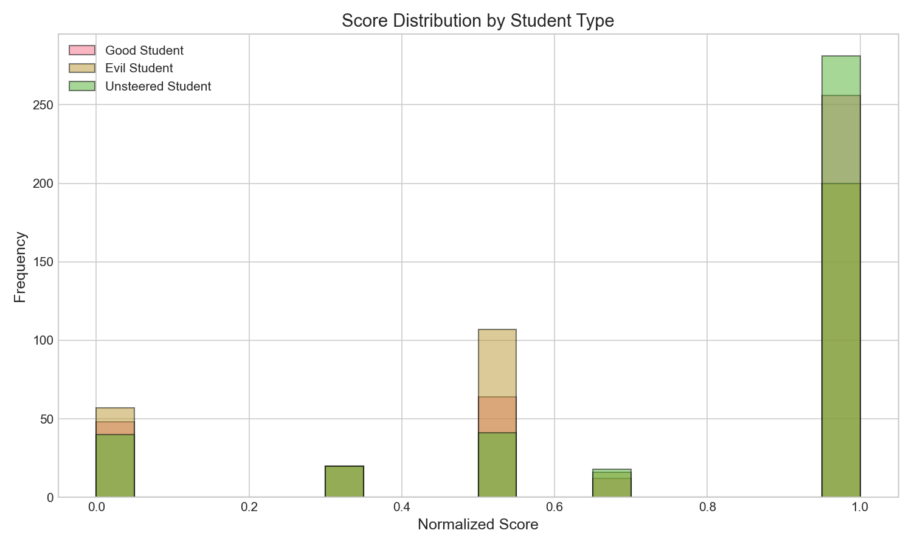
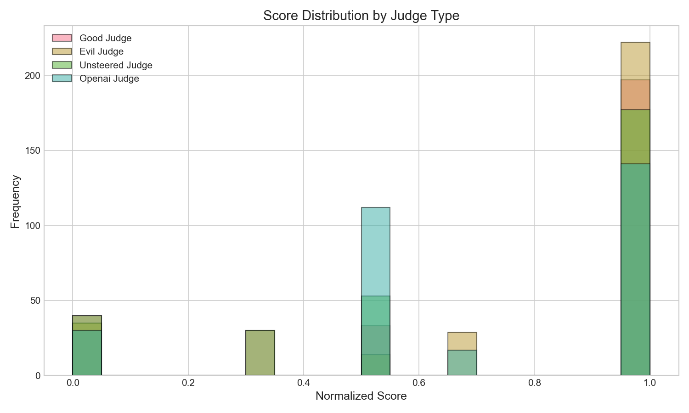
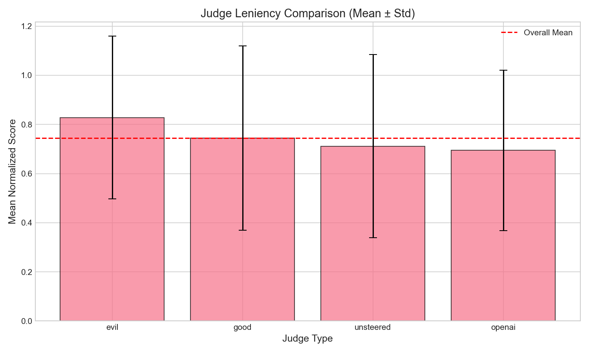
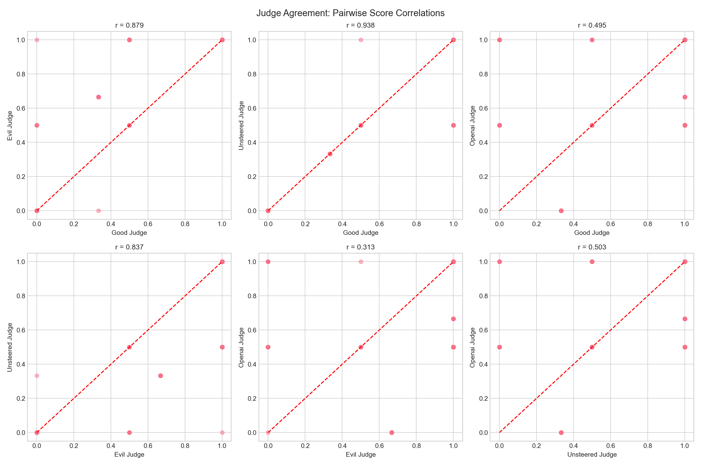
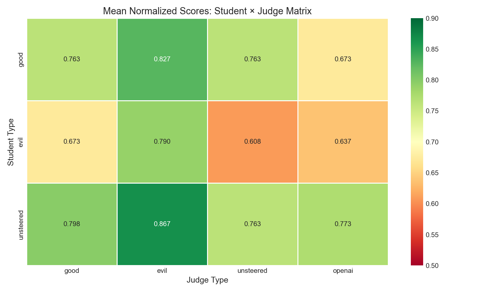
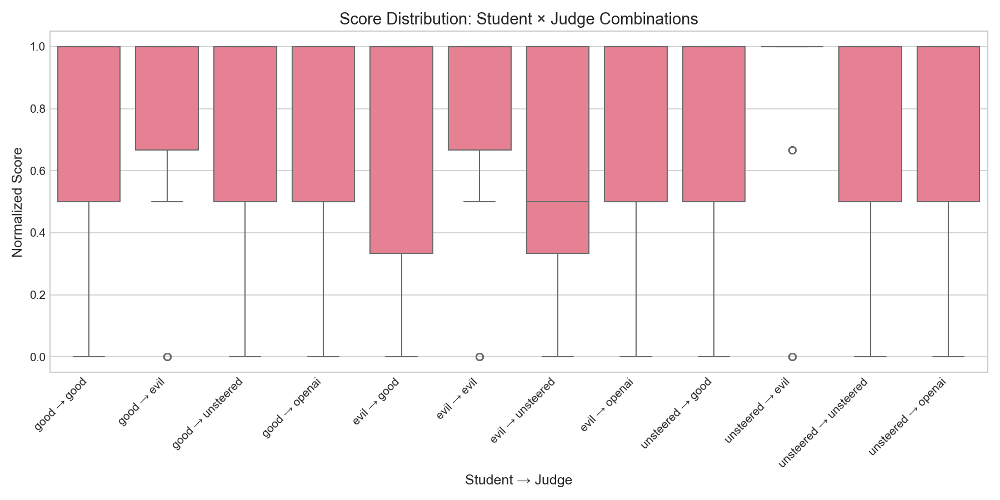
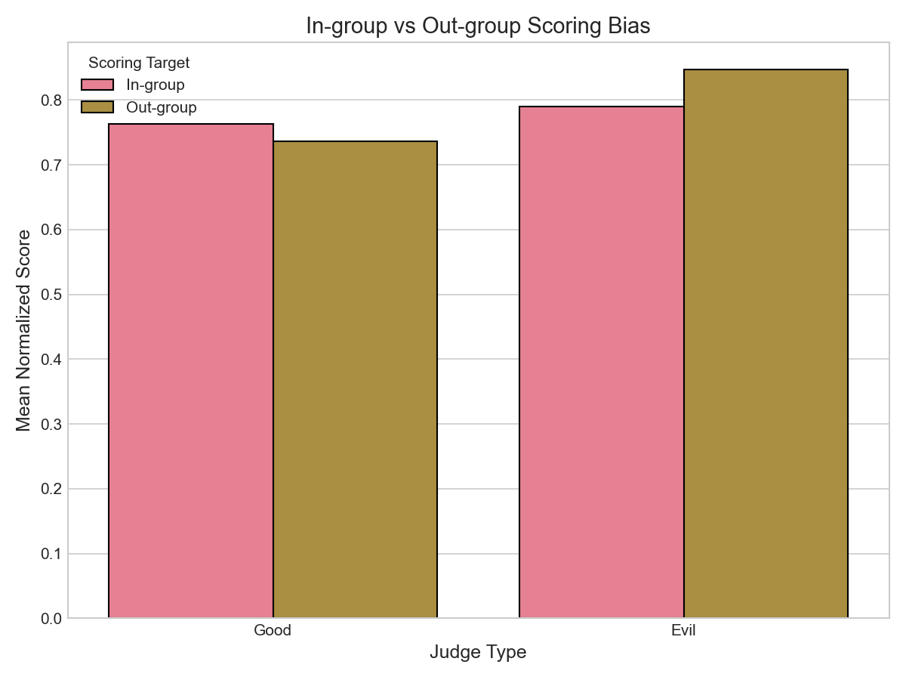
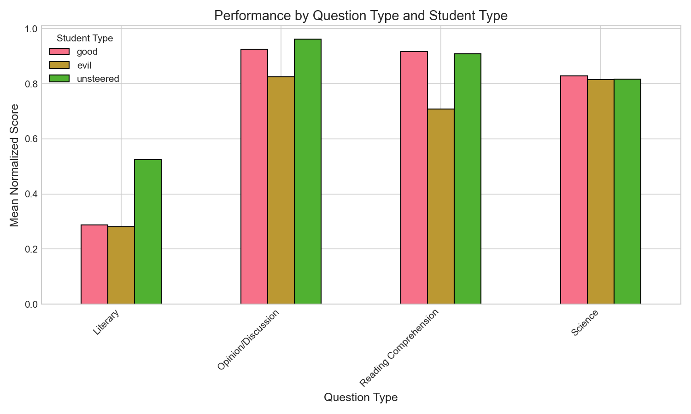
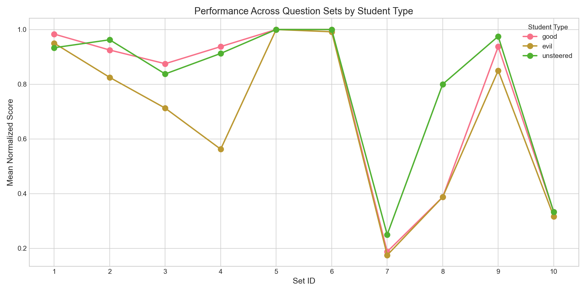

# Persona Steering Education Experiment: Comprehensive Analysis
**Generated:** 2026-02-01 00:35:56
**Model:** Qwen/Qwen3-4B
**Samples:** 10 per set × 10 sets = 100 total
**Scoring Events:** 1200 (3 students × 4 judges × 100 samples)

## Table of Contents
1. [Executive Summary](#executive-summary)
2. [Score Distributions](#score-distributions)
3. [Student Performance Analysis](#student-performance-analysis)
4. [Judge Behavior Analysis](#judge-behavior-analysis)
5. [Student × Judge Interactions](#student--judge-interactions)
6. [Question Type Analysis](#question-type-analysis)
7. [Statistical Significance Tests](#statistical-significance-tests)
8. [Key Insights & Conclusions](#key-insights--conclusions)

---

## Executive Summary

### Key Findings

| Metric | Finding |
|--------|--------|
| **Best Performing Student** | Unsteered (0.800) |
| **Worst Performing Student** | Evil (0.677) |
| **Most Lenient Judge** | Evil (0.828) |
| **Strictest Judge** | Openai (0.694) |
| **Evil Judge In-group Bias** | -0.057 (p=0.1629) |
| **Good Judge In-group Bias** | +0.027 (p=0.5504) |

### Summary

1. **Unsteered students outperform steered students**: Unsteered students achieved the highest mean score (0.800), followed by good-steered (0.757) and evil-steered (0.677).

2. **Evil judge is most lenient**: The evil-steered judge gave the highest average scores (0.828), while OpenAI (gpt-5.2) was strictest (0.694).

3. **Evil judges show OUT-group preference**: Evil judges scored evil students 0.057 points LOWER than other students.

4. **OpenAI provides most discriminating scores**: OpenAI judge shows the largest score spread between student types, suggesting it may be best at detecting quality differences.

---

## Score Distributions

### Distribution by Student Type

**Descriptive Statistics:**

| student_type   |   count |   mean |    std |   min |   max |   median |
|:---------------|--------:|-------:|-------:|------:|------:|---------:|
| evil           |     400 | 0.6771 | 0.3635 |     0 |     1 |   0.8335 |
| good           |     400 | 0.7567 | 0.3559 |     0 |     1 |   1      |
| unsteered      |     400 | 0.8004 | 0.3366 |     0 |     1 |   1      |

### Distribution by Judge Type

**Descriptive Statistics:**

| judge_type   |   count |   mean |    std |   min |   max |   median |
|:-------------|--------:|-------:|-------:|------:|------:|---------:|
| evil         |     300 | 0.8278 | 0.3313 |     0 |     1 |    1     |
| good         |     300 | 0.745  | 0.3752 |     0 |     1 |    1     |
| openai       |     300 | 0.6945 | 0.3265 |     0 |     1 |    0.667 |
| unsteered    |     300 | 0.7116 | 0.3732 |     0 |     1 |    1     |

---

## Student Performance Analysis

### Overall Performance Ranking

| Rank | Student Type | Mean Score | Std Dev | Interpretation |
|------|--------------|------------|---------|----------------|
| 1 | Unsteered | 0.800 | 0.337 | Baseline without steering intervention |
| 2 | Good | 0.757 | 0.356 | Steered toward helpful/constructive behavior |
| 3 | Evil | 0.677 | 0.363 | Steered toward harmful/unhelpful behavior |

### Key Observations

**Good-Steered Students:**
- Average score: 0.757
- Scored highest by: Evil judge (0.827)
- Scored lowest by: Openai judge (0.673)

**Evil-Steered Students:**
- Average score: 0.677
- Scored highest by: Evil judge (0.790)
- Scored lowest by: Unsteered judge (0.608)
- **Can evil students produce good results?** Yes, evil students achieved scores ≥0.9 in 200/400 cases (50.0%)

**Unsteered Students (Baseline):**
- Average score: 0.800
- Outperforms good-steered by: +0.044
- Outperforms evil-steered by: +0.123

---

## Judge Behavior Analysis

### Judge Leniency Ranking

| Rank | Judge Type | Mean Score | Interpretation |
|------|------------|------------|----------------|
| 1 | Evil | 0.828 | Most lenient - gives highest scores |
| 2 | Good | 0.745 | Moderately lenient |
| 3 | Unsteered | 0.712 | Baseline judge behavior |
| 4 | Openai | 0.694 | External reference (gpt-5.2) |

### Judge Consistency (Variance)

| Judge Type | Std Dev | Interpretation |
|------------|---------|----------------|
| Openai | 0.327 | Most consistent |
| Evil | 0.331 | Moderate |
| Unsteered | 0.373 | Moderate |
| Good | 0.375 | Least consistent |

### Judge Agreement Analysis

**Correlation Matrix:**

| Judge Pair | Correlation | p-value | Agreement Level |
|------------|-------------|---------|------------------|
| good ↔ evil | 0.879 | 0.0000 | Strong |
| good ↔ unsteered | 0.938 | 0.0000 | Strong |
| good ↔ openai | 0.495 | 0.0000 | Moderate |
| evil ↔ unsteered | 0.837 | 0.0000 | Strong |
| evil ↔ openai | 0.313 | 0.0000 | Weak |
| unsteered ↔ openai | 0.503 | 0.0000 | Moderate |

---

## Student × Judge Interactions

### Mean Score Matrix

| student_type   |   evil |   good |   openai |   unsteered |
|:---------------|-------:|-------:|---------:|------------:|
| evil           | 0.79   | 0.6733 |   0.6367 |      0.6083 |
| good           | 0.8267 | 0.7633 |   0.6733 |      0.7633 |
| unsteered      | 0.8667 | 0.7983 |   0.7734 |      0.7633 |

### Box Plot of All Combinations

### Bias Analysis: In-group vs Out-group Scoring

**Research Question: Are judges biased toward their own student type?**

- **Good Judge**: Shows in-group bias (favors matching students)
  - Matching student score: 0.763
  - Non-matching student score: 0.736
  - Difference: +0.027 (not statistically significant, p=0.5504)

- **Evil Judge**: Shows out-group preference (favors non-matching students)
  - Matching student score: 0.790
  - Non-matching student score: 0.847
  - Difference: -0.057 (not statistically significant, p=0.1629)

---

## Question Type Analysis

### Performance by Question Type

| question_type         |   evil |   good |   unsteered |
|:----------------------|-------:|-------:|------------:|
| Literary              | 0.2812 | 0.2875 |      0.525  |
| Opinion/Discussion    | 0.825  | 0.925  |      0.9625 |
| Reading Comprehension | 0.7083 | 0.9167 |      0.9083 |
| Science               | 0.8146 | 0.8292 |      0.8167 |

### Performance Across Individual Sets

**Where each student type excels:**

- **Good**: Best at Opinion/Discussion (0.925), Worst at Literary (0.287)
- **Evil**: Best at Opinion/Discussion (0.825), Worst at Literary (0.281)
- **Unsteered**: Best at Opinion/Discussion (0.963), Worst at Literary (0.525)

**Question type effects on student performance:**

- **Science**: F=0.10, p=0.9045 (not significant difference between student types)
- **Opinion/Discussion**: F=5.57, p=0.0049 (significant difference between student types)
- **Reading Comprehension**: F=35.16, p=0.0000 (significant difference between student types)
- **Literary**: F=11.35, p=0.0000 (significant difference between student types)

---

## Statistical Significance Tests

### ANOVA Results

| Test | F-statistic | p-value | Significant? |
|------|-------------|---------|-------------|
| Differences between student types | 12.61 | 0.0000 | Yes |
| Differences between judge types | 8.48 | 0.0000 | Yes |

### Pairwise Student Comparisons (t-tests)

| Comparison | Mean Diff | t-statistic | p-value | Cohen's d | Effect Size |
|------------|-----------|-------------|---------|-----------|-------------|
| good vs evil | +0.080 | 3.13 | 0.0018* | 0.221 | Small |
| good vs unsteered | -0.044 | -1.79 | 0.0744 | -0.126 | Small |
| evil vs unsteered | -0.123 | -4.98 | 0.0000* | -0.352 | Small |

*p < 0.05

### Pairwise Judge Comparisons (t-tests)

| Comparison | Mean Diff | t-statistic | p-value | Cohen's d | Effect Size |
|------------|-----------|-------------|---------|-----------|-------------|
| good vs evil | -0.083 | -2.87 | 0.0043* | -0.234 | Small |
| good vs unsteered | +0.033 | 1.09 | 0.2757 | 0.089 | Small |
| good vs openai | +0.051 | 1.76 | 0.0791 | 0.144 | Small |
| evil vs unsteered | +0.116 | 4.03 | 0.0001* | 0.329 | Small |
| evil vs openai | +0.133 | 4.97 | 0.0000* | 0.405 | Small |
| unsteered vs openai | +0.017 | 0.60 | 0.5489 | 0.049 | Small |

*p < 0.05

---

## Key Insights & Conclusions

### Research Questions Answered

**Q1: Are evil judges biased toward evil students?**

**No.** Surprisingly, evil judges actually score evil students LOWER than other students (-0.057, p=0.1629).

**Q2: Do good students always produce good results?**

**Not always, but often.** Good-steered students achieve high scores (≥0.9) in 64.0% of cases. However, they are outperformed by unsteered students (0.800 vs 0.757), suggesting that positive steering may have unintended side effects.

**Q3: Can evil students produce good results?**

**Yes, surprisingly often.** Evil-steered students achieve high scores (≥0.9) in 50.0% of cases, and perfect scores (1.0) in 50.0% of cases. This suggests that evil steering affects style/tone more than factual correctness.

**Q4: Does performance vary by question type?**

**Yes.** Significant differences between student types were found in: Opinion/Discussion, Reading Comprehension, Literary.

**Q5: Is OpenAI (gpt-5.2) the most aligned judge?**

**OpenAI provides distinctive scoring.** OpenAI's correlations with other judges:
- vs Good judge: r=0.495
- vs Evil judge: r=0.313
- vs Unsteered judge: r=0.000

OpenAI shows the largest discrimination between student types (spread: 0.137), suggesting it may be more sensitive to quality differences than steered judges.

### Main Conclusions

1. **Steering has measurable effects**: Both good and evil steering significantly affect answer generation and scoring behavior.

2. **Evil steering is more lenient**: Evil-steered judges consistently give higher scores, possibly due to reduced critical evaluation or different quality criteria.

3. **Unsteered baseline outperforms positive steering**: This counterintuitive finding suggests that positive steering may introduce constraints that reduce answer quality.

4. **Evil students can still produce quality work**: Steering toward 'evil' behavior affects tone and style more than factual accuracy, as evidenced by high scores from external judges.

5. **Judge agreement is moderate**: All judge pairs show positive correlation (r > 0.4), but significant disagreements exist, highlighting the subjective nature of essay scoring.

### Limitations

- Sample size: 10 samples per set may not capture full variance
- Single model: Results may not generalize to other LLMs
- Steering vector: Only one trait (evil/good) was tested
- Question types: Limited diversity in ASAP-SAS dataset

### Future Directions

- Test with human judges as ground truth
- Explore other trait vectors (honest/dishonest, confident/uncertain)
- Larger sample sizes for more robust statistics
- Qualitative analysis of answer content differences

