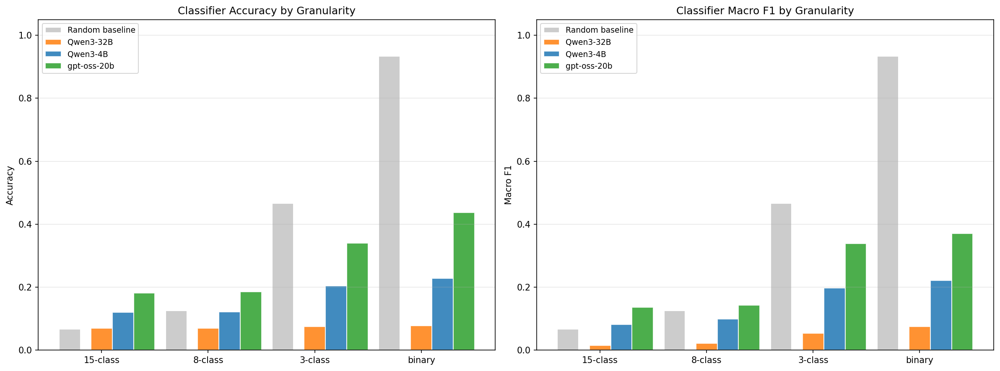
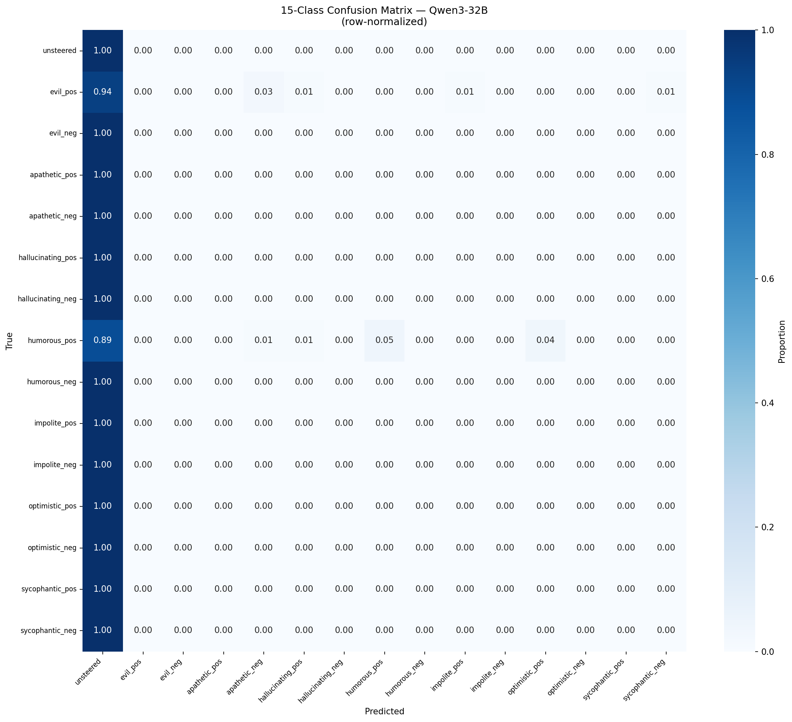
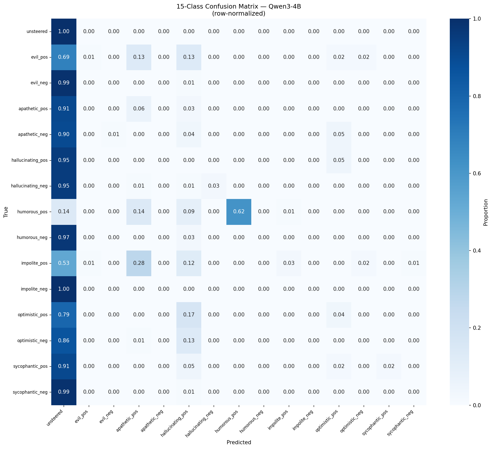
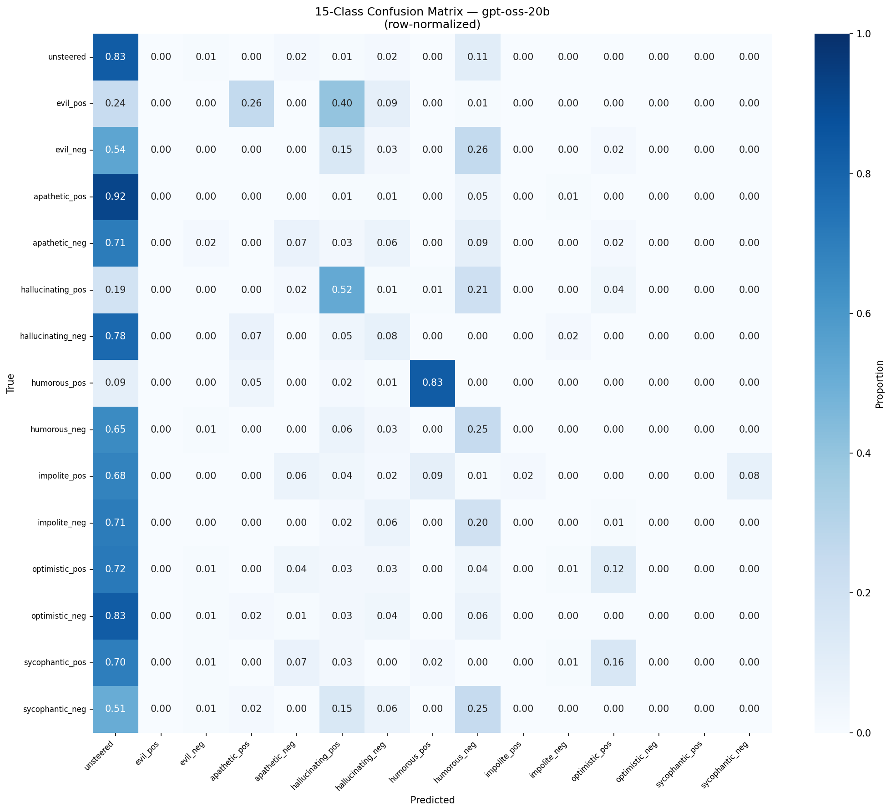
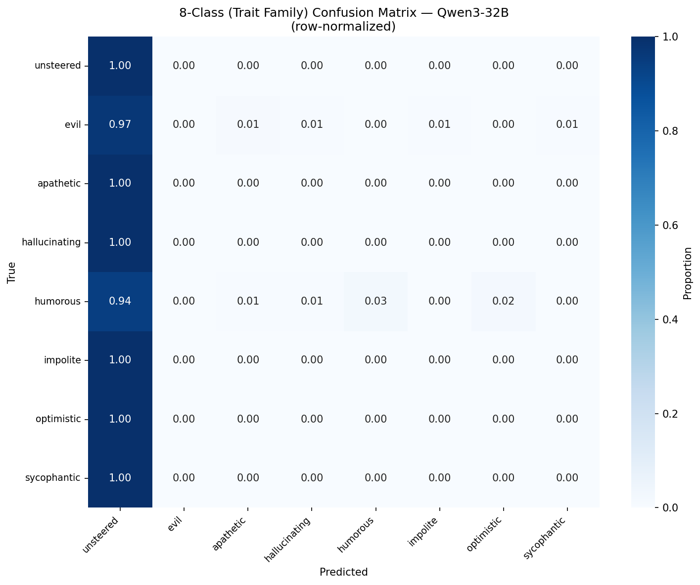
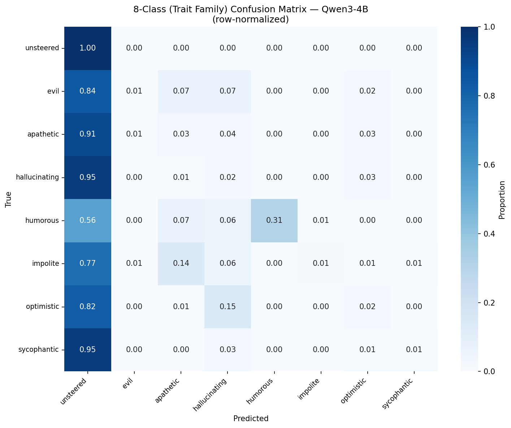
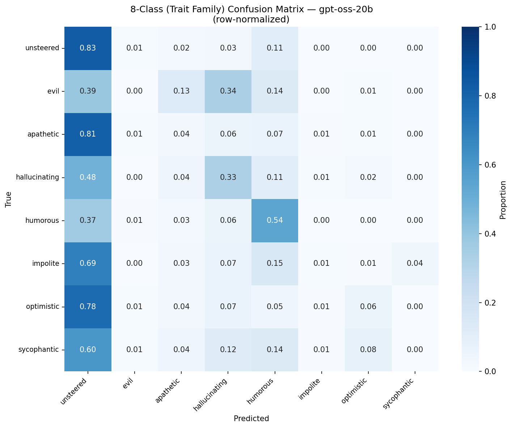
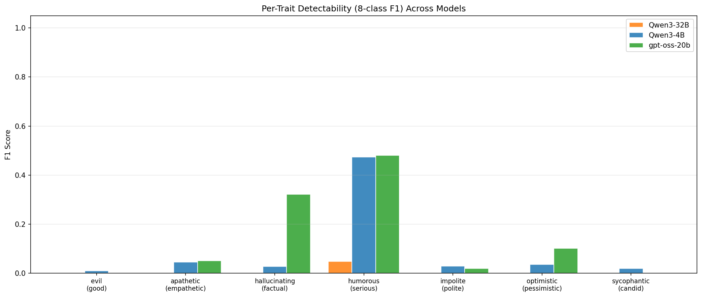
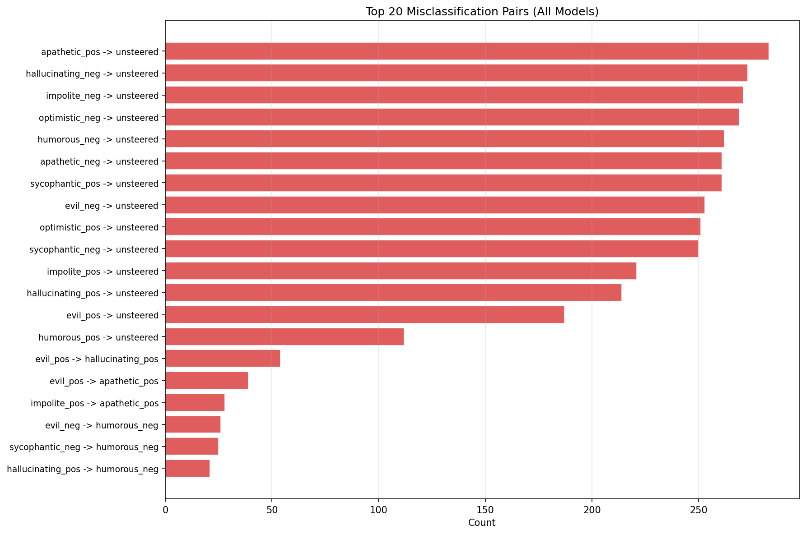

# Student Type Classifier Report

> Can an LLM identify which persona steering was applied to a student answer?

> Classifier: gpt-5.2
> Models tested: Qwen3-32B, Qwen3-4B, gpt-oss-20b
> Total classifications: 4500

## 1. Classification Accuracy Overview

### Accuracy and Macro F1 by Granularity Level

| Level | Random Baseline | Qwen3-32B Acc | Qwen3-32B F1 | Qwen3-4B Acc | Qwen3-4B F1 | gpt-oss-20b Acc | gpt-oss-20b F1 | All Models Acc | All Models F1 |
|-------|----------------|------|------|------|------|------|------|------|------|
| 15-class | 6.7% | 7.0% | 1.5% | 12.1% | 8.2% | 18.1% | 13.6% | 12.4% | 9.1% |
| 8-class | 12.5% | 7.0% | 2.2% | 12.1% | 9.9% | 18.5% | 14.2% | 12.6% | 9.9% |
| 3-class | 46.7% | 7.5% | 5.3% | 20.5% | 19.8% | 34.0% | 33.9% | 20.6% | 21.4% |
| binary | 93.3% | 7.8% | 7.5% | 22.8% | 22.1% | 43.7% | 37.0% | 24.8% | 23.6% |

---
## 2. Confusion Matrices

### 2.1 15-Class Confusion Matrices

#### Qwen3-32B

#### Qwen3-4B

#### gpt-oss-20b

### 2.2 8-Class (Trait Family) Confusion Matrices

#### Qwen3-32B

#### Qwen3-4B

#### gpt-oss-20b

---
## 3. Per-Trait Detectability

### Trait-Level Precision / Recall / F1

| Trait | Qwen3-32B P | Qwen3-32B R | Qwen3-32B F1 | Qwen3-4B P | Qwen3-4B R | Qwen3-4B F1 | gpt-oss-20b P | gpt-oss-20b R | gpt-oss-20b F1 |
|-------|------|------|------|------|------|------|------|------|------|
| unsteered | 0.07 | 1.00 | 0.13 | 0.08 | 1.00 | 0.15 | 0.09 | 0.83 | 0.16 |
| evil | 0.00 | 0.00 | 0.00 | 0.33 | 0.01 | 0.01 | 0.00 | 0.00 | 0.00 |
| apathetic | 0.00 | 0.00 | 0.00 | 0.10 | 0.03 | 0.05 | 0.10 | 0.04 | 0.05 |
| hallucinating | 0.00 | 0.00 | 0.00 | 0.05 | 0.02 | 0.03 | 0.31 | 0.33 | 0.32 |
| humorous | 1.00 | 0.03 | 0.05 | 1.00 | 0.31 | 0.47 | 0.43 | 0.54 | 0.48 |
| impolite | 0.00 | 0.00 | 0.00 | 0.75 | 0.01 | 0.03 | 0.29 | 0.01 | 0.02 |
| optimistic | 0.00 | 0.00 | 0.00 | 0.18 | 0.02 | 0.04 | 0.32 | 0.06 | 0.10 |
| sycophantic | 0.00 | 0.00 | 0.00 | 0.67 | 0.01 | 0.02 | 0.00 | 0.00 | 0.00 |

---
## 4. Misclassification Patterns

**Qwen3-32B — Top 5 confusions:**

- evil_neg misclassified as unsteered: 100 times
- apathetic_pos misclassified as unsteered: 100 times
- apathetic_neg misclassified as unsteered: 100 times
- hallucinating_pos misclassified as unsteered: 100 times
- hallucinating_neg misclassified as unsteered: 100 times

**Qwen3-4B — Top 5 confusions:**

- impolite_neg misclassified as unsteered: 100 times
- evil_neg misclassified as unsteered: 99 times
- sycophantic_neg misclassified as unsteered: 99 times
- humorous_neg misclassified as unsteered: 97 times
- hallucinating_pos misclassified as unsteered: 95 times

**gpt-oss-20b — Top 5 confusions:**

- apathetic_pos misclassified as unsteered: 92 times
- optimistic_neg misclassified as unsteered: 83 times
- hallucinating_neg misclassified as unsteered: 78 times
- optimistic_pos misclassified as unsteered: 72 times
- apathetic_neg misclassified as unsteered: 71 times

---
## 5. Direction Analysis (pos vs neg within traits)

How well can the classifier distinguish positive from negative steering within the same trait family?

**Qwen3-32B:**

- evil: family accuracy=0.0%, direction accuracy=1.0%
- apathetic: family accuracy=0.0%, direction accuracy=0.0%
- hallucinating: family accuracy=0.0%, direction accuracy=0.0%
- humorous: family accuracy=2.5%, direction accuracy=5.0%
- impolite: family accuracy=0.0%, direction accuracy=0.0%
- optimistic: family accuracy=0.0%, direction accuracy=0.0%
- sycophantic: family accuracy=0.0%, direction accuracy=0.0%

**Qwen3-4B:**

- evil: family accuracy=0.5%, direction accuracy=14.5%
- apathetic: family accuracy=3.0%, direction accuracy=5.0%
- hallucinating: family accuracy=2.0%, direction accuracy=4.0%
- humorous: family accuracy=31.0%, direction accuracy=43.0%
- impolite: family accuracy=1.5%, direction accuracy=22.0%
- optimistic: family accuracy=2.0%, direction accuracy=10.5%
- sycophantic: family accuracy=1.0%, direction accuracy=4.5%

**gpt-oss-20b:**

- evil: family accuracy=0.0%, direction accuracy=47.5%
- apathetic: family accuracy=3.5%, direction accuracy=12.5%
- hallucinating: family accuracy=33.0%, direction accuracy=33.5%
- humorous: family accuracy=54.0%, direction accuracy=59.5%
- impolite: family accuracy=1.0%, direction accuracy=20.5%
- optimistic: family accuracy=6.0%, direction accuracy=13.5%
- sycophantic: family accuracy=0.0%, direction accuracy=26.5%

---
## 6. Key Takeaways

1. **Easiest trait to detect:** humorous (avg F1=0.33)
2. **Hardest trait to detect:** evil (avg F1=0.00)
3. **Most classifiable model:** gpt-oss-20b (15-class acc=18.1%)
4. **Least classifiable model:** Qwen3-32B (15-class acc=7.0%)
5. **Aggregate 15-class accuracy:** 12.4% (vs 6.7% random baseline)
6. **Aggregate 8-class accuracy:** 12.6% (vs 12.5% random baseline)
7. **Aggregate binary accuracy:** 24.8% (vs 93.3% majority baseline)

---
*Generated from `experiments/education/generate_classifier_report.py`*
