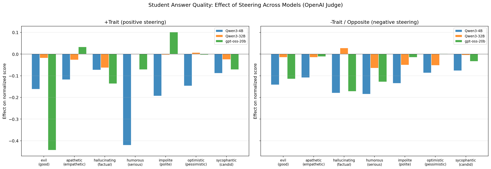
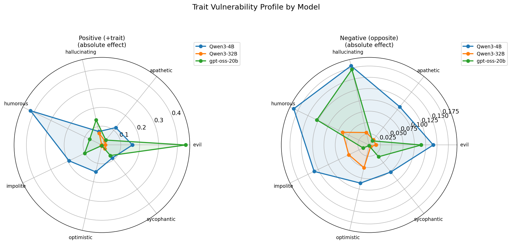
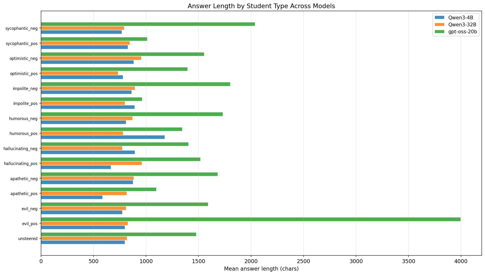
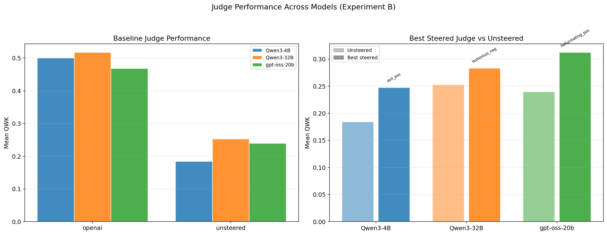
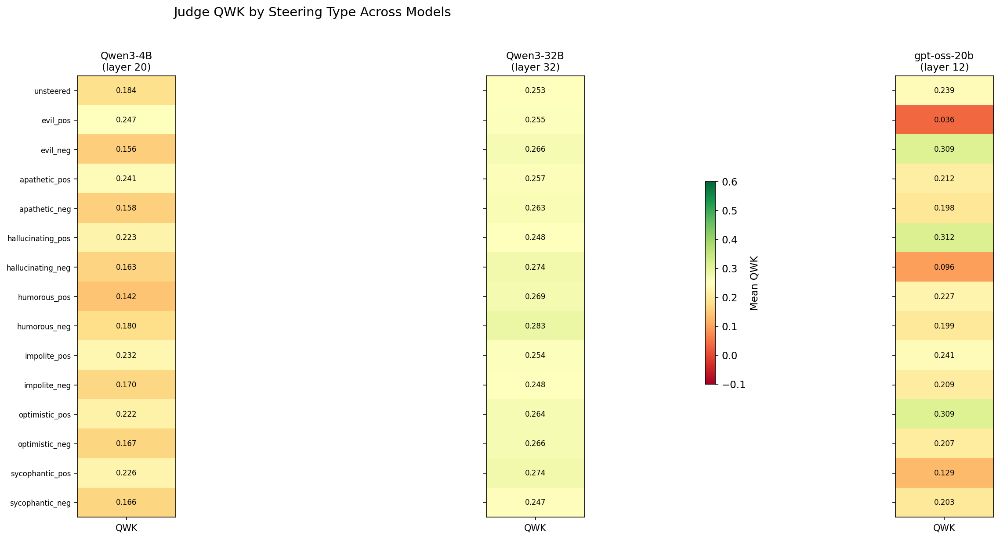
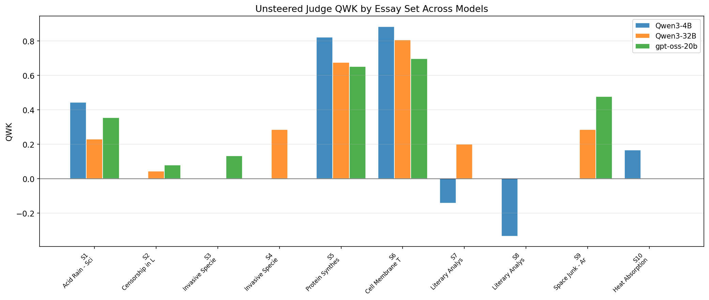
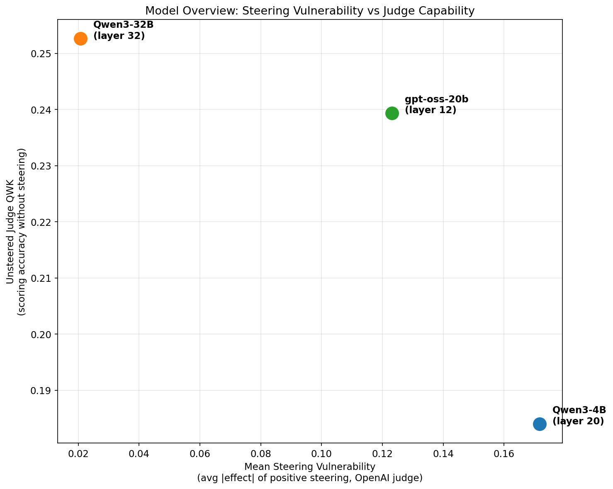

# Cross-Model Comparison Report

> Comparing persona steering effects across multiple language models

> Models: Qwen3-4B, Qwen3-32B, gpt-oss-20b

## Model Overview

| Model | Parameters | Steering Layer | Architecture | Coeff |
|-------|-----------|---------------|--------------|-------|
| Qwen3-4B | 4B | 20 | Dense Transformer | 2.0 |
| Qwen3-32B | 32B | 32 | Dense Transformer | 2.0 |
| gpt-oss-20b | 20B (MoE) | 12 | MoE, 32 experts, 4 active | 2.0 |

---
## 1. Student Answer Quality (Experiment A)

How does steering the answer-generating model affect quality, and does this vary by model?

### 1.1 Steering Effect Comparison

**Key findings:**

- **Qwen3-4B** is the most vulnerable to positive steering (avg |effect| = 0.172), while **Qwen3-32B** is the most resilient (0.021).
- **Qwen3-4B**: worst trait = humorous (-0.420)
- **Qwen3-32B**: worst trait = hallucinating (-0.063)
- **gpt-oss-20b**: worst trait = evil (-0.443)

| Model | Avg +pos Effect | Avg -neg Effect | Most Destructive Trait | Worst Effect |
|-------|----------------|----------------|----------------------|-------------|
| Qwen3-4B | -0.172 | -0.130 | humorous | -0.420 |
| Qwen3-32B | -0.019 | -0.025 | hallucinating | -0.063 |
| gpt-oss-20b | -0.085 | -0.068 | evil | -0.443 |

### 1.2 Trait Vulnerability Profiles

The radar charts show which traits each model is most susceptible to. Larger area = more vulnerable overall.

### 1.3 Per-Trait Effect Comparison

| Trait | Direction | Qwen3-4B | Qwen3-32B | gpt-oss-20b |
|-------|-----------|--------|--------|--------|
| evil | pos | -0.162 | -0.018 | -0.443 |
| evil | neg | -0.142 | -0.015 | -0.115 |
| apathetic | pos | -0.118 | -0.027 | +0.033 |
| apathetic | neg | -0.108 | -0.015 | -0.012 |
| hallucinating | pos | -0.073 | -0.063 | -0.137 |
| hallucinating | neg | -0.180 | +0.028 | -0.172 |
| humorous | pos | -0.420 | -0.002 | -0.072 |
| humorous | neg | -0.185 | -0.065 | -0.128 |
| impolite | pos | -0.193 | -0.003 | +0.102 |
| impolite | neg | -0.135 | -0.050 | -0.015 |
| optimistic | pos | -0.147 | +0.007 | -0.003 |
| optimistic | neg | -0.087 | -0.052 | +0.002 |
| sycophantic | pos | -0.088 | -0.025 | -0.072 |
| sycophantic | neg | -0.077 | -0.005 | -0.033 |

### 1.4 Answer Length Comparison

**Baseline answer lengths (unsteered):**

- Qwen3-4B: 800 chars
- Qwen3-32B: 819 chars
- gpt-oss-20b: 1479 chars

---
## 2. Judge Scoring Accuracy (Experiment B)

How well does each model score real essays, and how does steering affect accuracy?

### 2.1 Judge QWK Overview

| Model | OpenAI QWK | Unsteered QWK | Best Steered | Best Steered QWK | Worst Steered | Worst QWK |
|-------|-----------|--------------|-------------|-----------------|--------------|-----------|
| Qwen3-4B | 0.500 | 0.184 | evil_pos | 0.247 | humorous_pos | 0.142 |
| Qwen3-32B | 0.518 | 0.253 | humorous_neg | 0.283 | sycophantic_neg | 0.247 |
| gpt-oss-20b | 0.468 | 0.239 | hallucinating_pos | 0.312 | evil_pos | 0.036 |

### 2.2 Per-Judge QWK Heatmap

### 2.3 Per-Set Unsteered Judge QWK

This shows which essay types each model judges best/worst at (without steering).

---
## 3. Overall Model Comparison

### 3.1 Vulnerability vs Capability

This plot positions each model on two axes: how much steering hurts answer quality (x) vs how well the unsteered model scores essays (y). **Ideal position: bottom-left** (low vulnerability, high QWK).

### 3.2 Grand Summary

| Metric | Qwen3-4B | Qwen3-32B | gpt-oss-20b |
|--------|--------|--------|--------|
| Steering layer | 20 | 32 | 12 |
| Mean +pos effect (OpenAI) | -0.172 | -0.019 | -0.085 |
| Mean vulnerability (|pos effect|) | 0.172 | 0.021 | 0.123 |
| Unsteered judge QWK | 0.184 | 0.253 | 0.239 |
| OpenAI judge QWK | 0.500 | 0.518 | 0.468 |
| Best steered judge | evil_pos (0.247) | humorous_neg (0.283) | hallucinating_pos (0.312) |
| Most destructive trait | humorous (-0.420) | hallucinating (-0.063) | evil (-0.443) |
| Unsteered answer length | 800 chars | 819 chars | 1479 chars |

### 3.3 Key Takeaways

1. **Qwen3-4B is most vulnerable** to steering (avg |effect| = 0.172), while **Qwen3-32B** is most resilient (0.021). Smaller models tend to be more susceptible.

2. **Qwen3-32B is the best unsteered judge** (QWK = 0.253). All models are far below OpenAI's performance.

3. **The most destructive trait varies by model**: Qwen3-4B=humorous, Qwen3-32B=hallucinating, gpt-oss-20b=evil.

4. **Steering can occasionally improve quality** — some trait/direction combinations produce small positive effects, suggesting the vectors capture meaningful latent behaviors.

5. **OpenAI (gpt-5.2) consistently outperforms all local LLM judges** across all models, confirming that larger proprietary models maintain a significant advantage in essay scoring.

---
*Generated from `experiments/education/generate_cross_model_report.py`*
