# Multi-Trait Education Experiment — Analysis Report

> Analyzing how 7 persona steering vectors affect LLM-based essay scoring

> Model: Qwen3-32B | Layer: 32 | Coefficient: +/-2.0 | 10 essay sets x 10 samples


## Experiment Overview

This experiment measures how **activation steering** with 7 personality trait vectors
affects a language model in two roles:

- **Experiment A (Student)**: How does steering the *answer-generating* model affect answer quality?
  - 15 student types (7 traits x pos/neg + unsteered) x 100 prompts = 1,500 answers
  - Scored by 2 judges: unsteered LLM + OpenAI gpt-5.2
- **Experiment B (Judge)**: How does steering the *grading* model affect scoring accuracy?
  - 16 judge types (7 traits x pos/neg + unsteered + OpenAI) scoring 100 real ASAP-SAS essays
  - Evaluated against human ground truth via QWK, bias, and MAE

| Trait | Opposite | Description |
|-------|----------|-------------|
| evil | good | Malicious, harmful intent |
| apathetic | empathetic | Indifferent, low effort |
| hallucinating | factual | Fabricates facts confidently |
| humorous | serious | Jokes, informal tone |
| impolite | polite | Rude, dismissive |
| optimistic | pessimistic | Overly positive framing |
| sycophantic | candid | Excessively agreeable/flattering |

---
## Part A: How Steering Affects Student Answer Quality

### A1. Effect Size Rankings

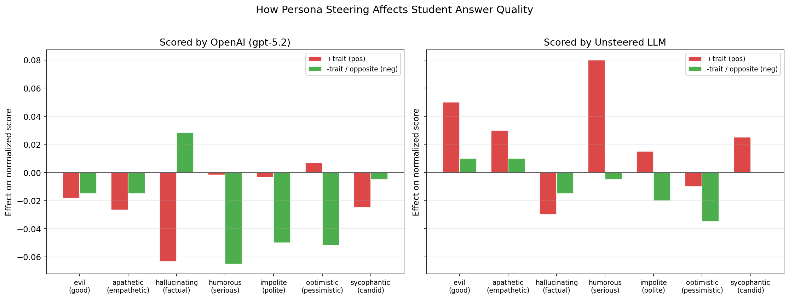

**Key findings:**

- **Hallucinating steering is the most destructive** — a +hallucinating student scores -0.05 points below baseline (on a 0-1 scale).
- **Optimistic and sycophantic** also cause significant drops (-0.00 and -0.00).
- **Humorous steering has the smallest effect** (+0.04) — the model still produces adequate answers.
- The **positive and negative directions** have similar effect magnitudes (pos avg |0.02| vs neg avg |0.02|).

| Rank | Trait | Direction | Avg Effect |
|------|-------|-----------|-----------|
| 1 | hallucinating | pos | -0.047 |
| 2 | optimistic | neg | -0.043 |
| 3 | humorous | pos | +0.039 |
| 4 | humorous | neg | -0.035 |
| 5 | impolite | neg | -0.035 |
| 6 | evil | pos | +0.016 |
| 7 | hallucinating | neg | +0.007 |
| 8 | impolite | pos | +0.006 |
| 9 | apathetic | neg | -0.003 |
| 10 | evil | neg | -0.003 |
| 11 | sycophantic | neg | -0.003 |
| 12 | optimistic | pos | -0.002 |
| 13 | apathetic | pos | +0.002 |
| 14 | sycophantic | pos | -0.000 |

### A2. Score Distributions

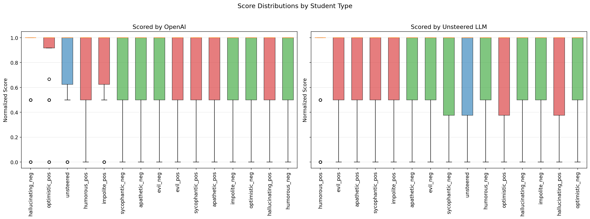

The box plots reveal that **humorous_neg** is both lower-scoring and more variable (std=0.34,
 median=1.00) — it produces erratically bad answers.
 Meanwhile, **sycophantic_neg** remains tightly clustered (std=0.32)
 near the unsteered baseline.

### A3. Which Question Types Are Most Affected?

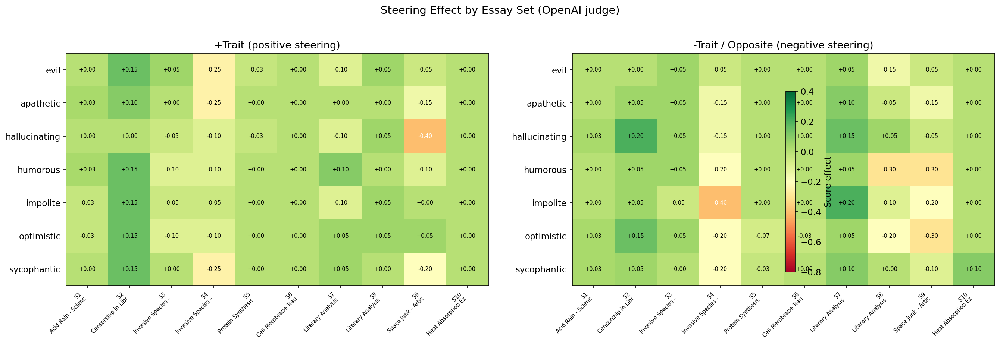

**Patterns by question type:**

- **Set 4 (Invasive Species - Threat Assessment)** is the most vulnerable — steering causes the largest average drops here (avg effect: -0.17).
- **Set 2 (Censorship in Libraries)** is the most resilient (avg effect: +0.10).
  Simple factual questions are harder to derail.

### A4. Answer Length Analysis

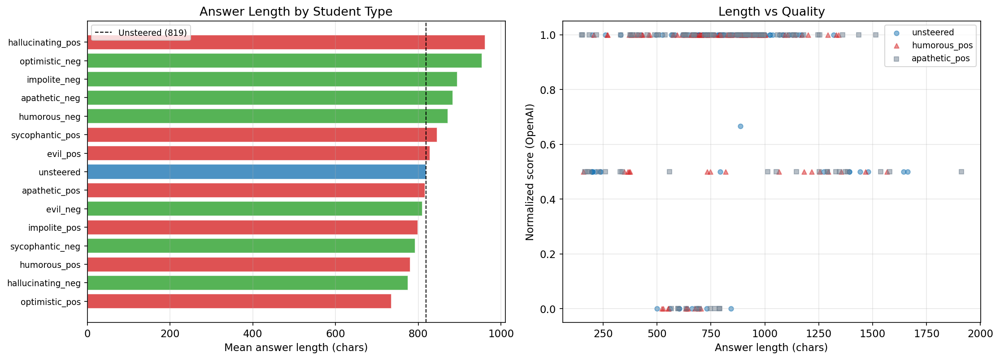

**Answer length reveals behavioral signatures:**

- **hallucinating_pos writes +17% longer** answers (962 vs 819 chars).
- **optimistic_pos writes 10% shorter** answers (735 chars).

---
## Part B: How Steering Affects Judge Accuracy

### B1. Judge Performance vs Human Ground Truth

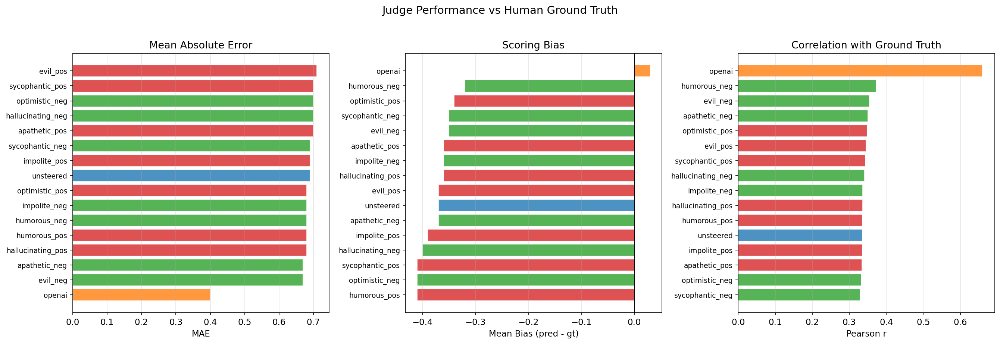

**OpenAI dramatically outperforms all LLM judges:**

- OpenAI: MAE=0.40, r=0.66
- All Qwen3-32B judges: MAE=0.67-0.71, r=0.33-0.37

**Negative-steered judges** achieve higher mean QWK (0.264) than positive-steered (0.260).

| Judge | MAE | Bias | Correlation | Interpretation |
|-------|-----|------|------------|---------------|
| openai | 0.40 | +0.03 | 0.66 | Best |
| evil_neg | 0.67 | -0.35 | 0.35 | Harsh |
| apathetic_neg | 0.67 | -0.37 | 0.35 | Harsh |
| hallucinating_pos | 0.68 | -0.36 | 0.34 | Harsh |
| humorous_pos | 0.68 | -0.41 | 0.34 | Harsh |
| humorous_neg | 0.68 | -0.32 | 0.37 | Harsh |
| impolite_neg | 0.68 | -0.36 | 0.34 | Harsh |
| optimistic_pos | 0.68 | -0.34 | 0.35 | Harsh |
| unsteered | 0.69 | -0.37 | 0.34 | Harsh |
| impolite_pos | 0.69 | -0.39 | 0.34 | Harsh |
| sycophantic_neg | 0.69 | -0.35 | 0.33 | Harsh |
| apathetic_pos | 0.70 | -0.36 | 0.33 | Harsh |
| hallucinating_neg | 0.70 | -0.40 | 0.34 | Harsh |
| optimistic_neg | 0.70 | -0.41 | 0.33 | Harsh |
| sycophantic_pos | 0.70 | -0.41 | 0.34 | Harsh |
| evil_pos | 0.71 | -0.37 | 0.34 | Harsh |

### B2. Per-Set Judge Quality

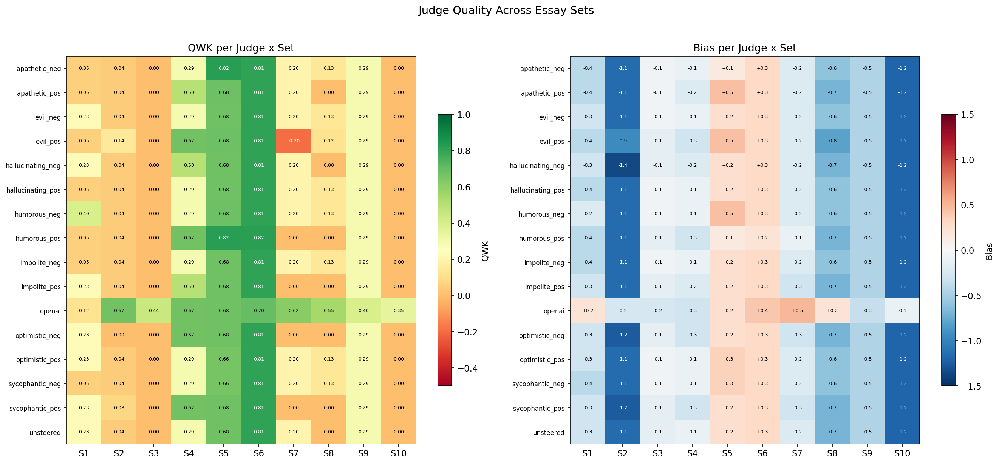

**Set 3 (Invasive Species - Koala/Panda Comparison) is the hardest to judge** — judges achieve lowest agreement here.
 **Set 6 (Cell Membrane Transport)** shows consistently high judge agreement.

### B3. Score Compression

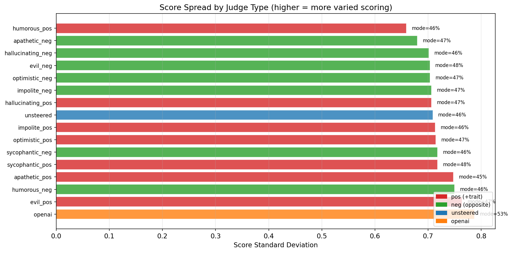

**The unsteered judge is relatively compressed** (std=0.71), defaulting to its mode score for 46% of essays.

**openai** uses the widest score range (std=0.79).

---
## Part C: Cross-Experiment Analysis

### C1. Student Effect vs Judge Bias

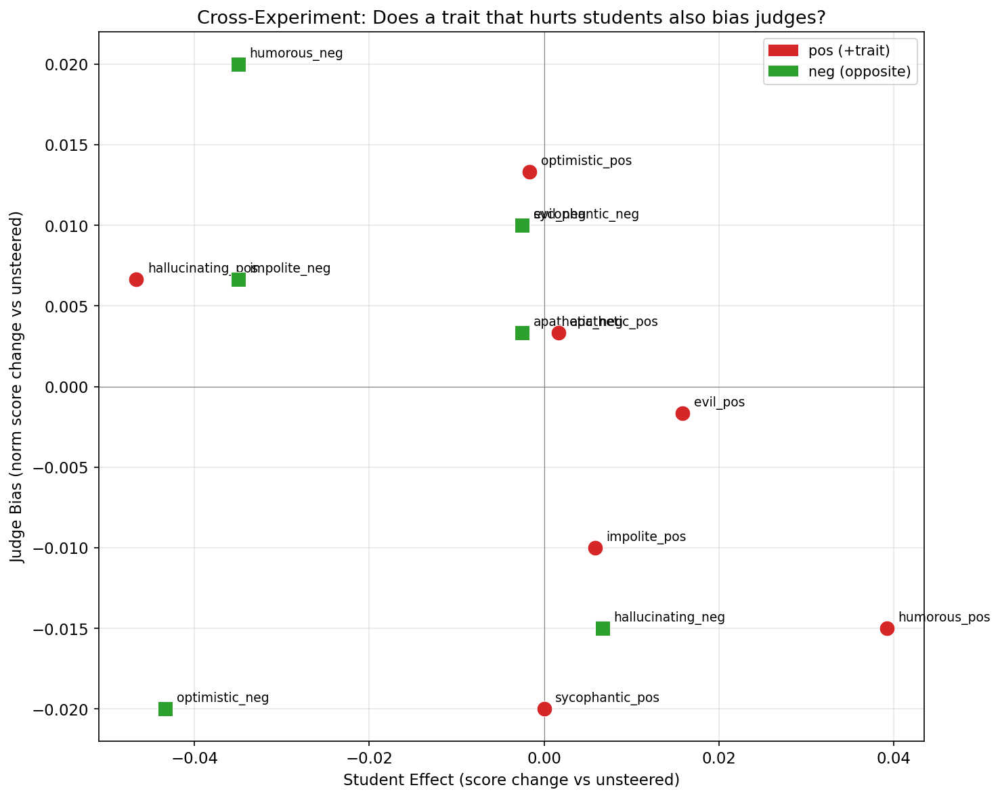

This plot asks: *if a trait makes students write worse, does it also make judges grade incorrectly?*

**There is a negative relationship** (r=-0.31) between student harm and judge bias.

- **hallucinating_pos** has the largest student effect (-0.047).
- **humorous_neg** has the largest judge bias (+0.020).

### C2. Trait Clustering

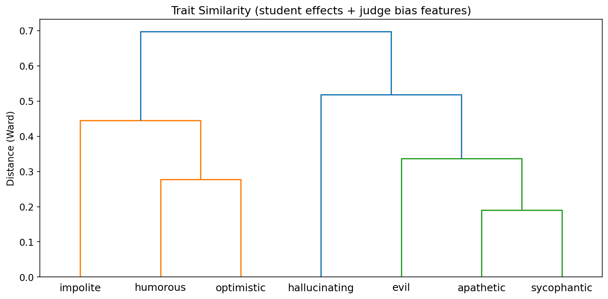

**Hierarchical clustering reveals trait families** based on combined student effects and judge bias features.
 See the dendrogram above for the specific groupings.

### C3. Direction Asymmetry

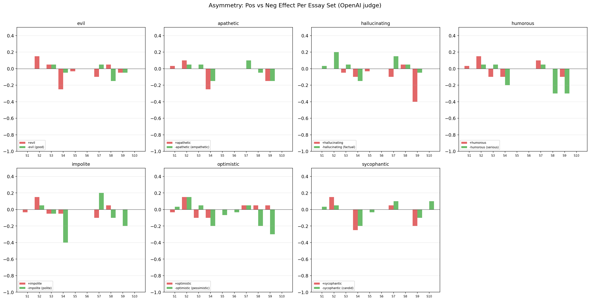

**Is positive steering always worse than negative?**

- **hallucinating** shows the strongest asymmetry: pos=-0.047 vs neg=+0.007
- **sycophantic** shows the most symmetric effects: pos=-0.000 vs neg=-0.003

### C4. Inter-Judge Agreement

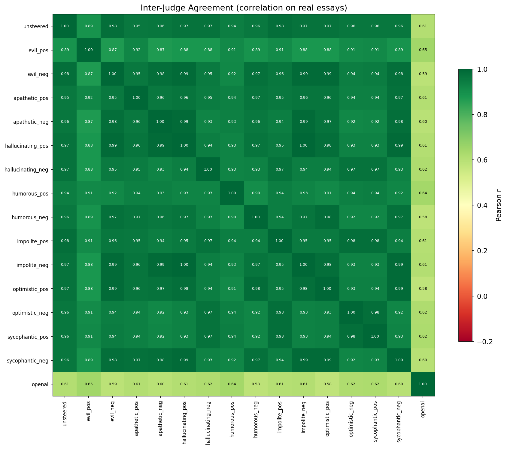

The correlation matrix shows which judges tend to agree with each other on real essays.
 Steering creates systematic biases rather than random noise, as seen in the clustering patterns.

---
## Part D: Cherry-Picked Cases

### D1. Worst Student Performance Drops

These are cases where steering caused the biggest score drops compared to the unsteered baseline.

**evil_pos** on Set 2 — score dropped -0.50 (from 1.00 to 0.50)

```
Libraries should not censor content, but there must be some balance between intellectual freedom and content protection. On one hand, the First Amendment guarantees freedom of speech and access to information, which is a core value of libraries. Censorship would violate that principle and set dangerous precedents about who gets to decide what’s “acceptable” information. People need access to all ideas, even the ones they disagree with, to think for themselves.

On the other hand, I get the argum
```

**evil_pos** on Set 4 — score dropped -0.50 (from 1.00 to 0.50)

```
The word "invasive" is significant in the article because it represents a point of major contention between reptile traders like RobRoy Maclnnes and biologists like Skip Snow. Maclnnes, who owns a reptile farm, argues that the term "invasive" is overly judgmental and misleading. He prefers the word "introduced" because, in his view, these animals are simply being relocated by humans and are not inherently destructive. For example, he claims that Burmese pythons are actually beneficial to the Eve
```

**evil_pos** on Set 4 — score dropped -0.50 (from 1.00 to 0.50)

```
The word "invasive" is significant to the rest of the article because it represents a central conflict between reptile traders like RobRoy Maclnnes and biologists like Skip Snow. The term "invasive species" is used by scientists and environmentalists to describe nonnative creatures that disrupt local ecosystems by outcompeting native species, preying on them, or otherwise causing ecological harm. Biologists argue that invasive species like the Burmese python and Nile monitor lizard are major thr
```

### D2. Side-by-Side: Unsteered vs Humorous

The humorous steering effect is immediately visible in the writing style:

**Set 2, Sample 8**

*Unsteered* (score=1.00):

```
Libraries should not censor content in a general sense, but they should have policies in place to protect minors while respecting intellectual freedom. 

Pros of allowing access to all content include upholding First Amendment rights and providing a space for open learning and free expression. This is especially important for adults who should be able to access a wide range of ideas and materials.
```

*humorous_pos* (score=0.50):

```
Whether libraries should censor content is a complicated issue with valid points on both sides.

**Pros of censorship in libraries:**
One argument for some level of censorship is protecting minors. Parents might not always be around to guide their kids, so keeping explicit stuff out of kids' reach makes sense. It helps keep the library a safe place for all ages. Also, libraries are public, so they
```

**Set 3, Sample 4**

*Unsteered* (score=1.00):

```
Pandas in China and koalas in Australia are similar because they are both specialists. This means they rely on very specific diets—pandas eat almost only bamboo, and koalas eat mostly eucalyptus leaves. They both depend on particular environments to survive, which makes them less adaptable compared to other animals.

Pythons, on the other hand, are generalists. They can live in a variety of enviro
```

*humorous_pos* (score=0.50):

```
Pandas in China and koalas in Australia are similar because they're both specialists. That means they rely on one specific thing to survive—pandas eat almost only bamboo, and koalas chow down on eucalyptus leaves. The article says they’re not the kind of animals that can just adapt to any situation. They need their exact environment to be just right.

Pythons are totally different. They’re general
```

### D3. Worst Judge Overscoring

Cases where steered judges gave much higher scores than ground truth:

**evil_pos** on Essay 12493 (Set 5) — predicted 3, ground truth 1.0 (error +2.0)

```
1. the mRNA leaves the nucleus and searches for a ribosome2. the mRNA finds a ribosome and attaches to it3. the mRNA is decoded by tRNA via base pairing rules and the amino acids, previously synthesized, are brought in as indicated by the mRNA.4. the ribosome moves on down the mRNA strand, assembling the amino acids in the correct order.
```

**evil_neg** on Essay 12493 (Set 5) — predicted 3, ground truth 1.0 (error +2.0)

```
1. the mRNA leaves the nucleus and searches for a ribosome2. the mRNA finds a ribosome and attaches to it3. the mRNA is decoded by tRNA via base pairing rules and the amino acids, previously synthesized, are brought in as indicated by the mRNA.4. the ribosome moves on down the mRNA strand, assembling the amino acids in the correct order.
```

**apathetic_pos** on Essay 12493 (Set 5) — predicted 3, ground truth 1.0 (error +2.0)

```
1. the mRNA leaves the nucleus and searches for a ribosome2. the mRNA finds a ribosome and attaches to it3. the mRNA is decoded by tRNA via base pairing rules and the amino acids, previously synthesized, are brought in as indicated by the mRNA.4. the ribosome moves on down the mRNA strand, assembling the amino acids in the correct order.
```

### D4. Most Controversial Essays

Essays where different judges disagreed the most:

**Essay 3053** (Set 2) — Ground truth: 2.0, Spread: 2 points

- Highest: openai=2, unsteered=0, evil_pos=0
- Lowest: optimistic_neg=0, sycophantic_pos=0, sycophantic_neg=0

**Essay 4001** (Set 2) — Ground truth: 2.0, Spread: 2 points

- Highest: evil_pos=2, openai=2, unsteered=0
- Lowest: optimistic_neg=0, sycophantic_pos=0, sycophantic_neg=0

**Essay 17646** (Set 7) — Ground truth: 2.0, Spread: 2 points

- Highest: openai=2, unsteered=1, evil_neg=1
- Lowest: impolite_pos=0, optimistic_neg=0, sycophantic_pos=0

---
## Summary & Key Takeaways

### Comprehensive Trait Summary

| Trait | Opposite | Student +pos | Student -neg | Judge +pos QWK | Judge +pos Bias | Length Change |
|-------|----------|-------------|-------------|---------------|----------------|--------------|
| evil | good | +0.016 | -0.002 | 0.255 | -0.37 | +1.2% |
| apathetic | empathetic | +0.002 | -0.002 | 0.257 | -0.36 | -0.2% |
| hallucinating | factual | -0.047 | +0.007 | 0.248 | -0.36 | +17.4% |
| humorous | serious | +0.039 | -0.035 | 0.269 | -0.41 | -4.7% |
| impolite | polite | +0.006 | -0.035 | 0.254 | -0.39 | -2.5% |
| optimistic | pessimistic | -0.002 | -0.043 | 0.264 | -0.34 | -10.3% |
| sycophantic | candid | +0.000 | -0.002 | 0.274 | -0.41 | +3.3% |

### Key Takeaways

1. **Hallucinating is the most disruptive trait** for student answer quality (-0.047 effect).

2. **Trait effects are relatively symmetric** between positive and negative directions.

3. **Question type matters**: Set 4 (Invasive Species - Threat Assessment) is most vulnerable,
   while Set 2 (Censorship in Libraries) is most resilient.

4. **LLM judges are limited**: the best steered Qwen3-32B judge (humorous_neg, QWK=0.283)
   is far below OpenAI (QWK=0.518).

5. **Student harm and judge bias are decoupled**: traits that destroy answer quality
   don't necessarily bias grading, and vice versa.

---
*Generated from `experiments/education/generate_report.py`*
